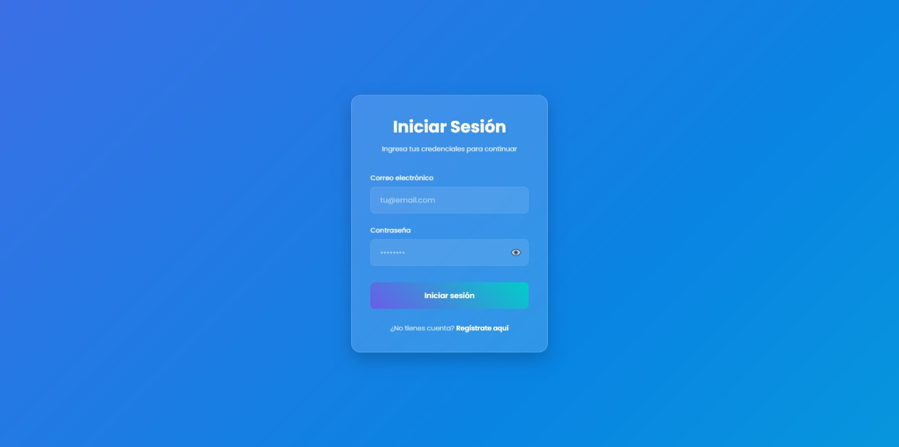

# Formulario de Login Moderno con Validación

Un formulario de inicio de sesión moderno, responsive y con validación en tiempo real, construido con HTML, CSS y JavaScript.

## Características principales

- **Diseño moderno**: Efecto glassmorphism con fondo animado en gradiente
- **Validación en tiempo real**: Para email y contraseña
- **Interactividad**:
  - Toggle para mostrar/ocultar contraseña
  - Efectos hover y focus
  - Animaciones al mostrar errores
- **Responsive**: Se adapta perfectamente a móviles y tablets
- **Feedback visual**: Estados de error y éxito claramente diferenciados

## Validaciones implementadas

- Email válido (formato correcto)
- Contraseña con al menos 6 caracteres
- Campos requeridos
- Validación mientras el usuario escribe

## Tecnologías utilizadas

- HTML5 semántico
- CSS3 moderno con variables, animaciones y efectos
- JavaScript vanilla (sin dependencias externas)

## Cómo usar

1. Clona este repositorio
2. Abre el archivo `index.html` en tu navegador
3. Prueba el formulario:
   - Ingresa un email inválido para ver el mensaje de error
   - Prueba contraseñas cortas
   - Usa el botón de ojo para mostrar/ocultar la contraseña

## Personalización

Puedes modificar fácilmente:
- Los colores en `:root` dentro de `assets/css/styles.css`
- Los mensajes de error en `assets/js/scripts.js`
- Las validaciones agregando nuevas reglas en JavaScript

## Vista previa

El formulario incluye:
- Campo para email con validación
- Campo para contraseña con toggle de visibilidad
- Botón de submit con estado de carga
- Enlace para registro (simulado)